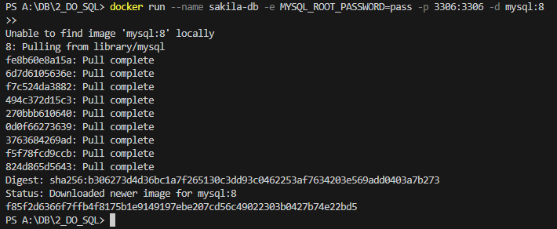
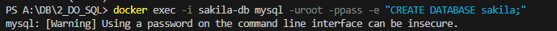
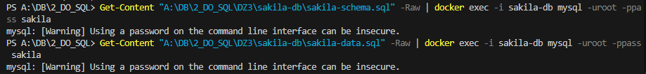
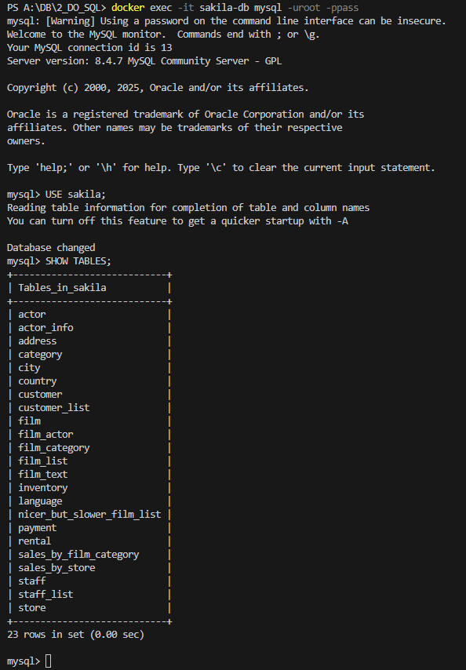
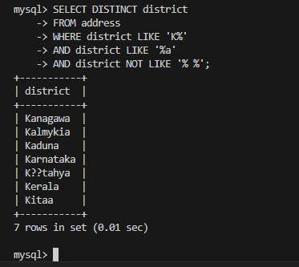
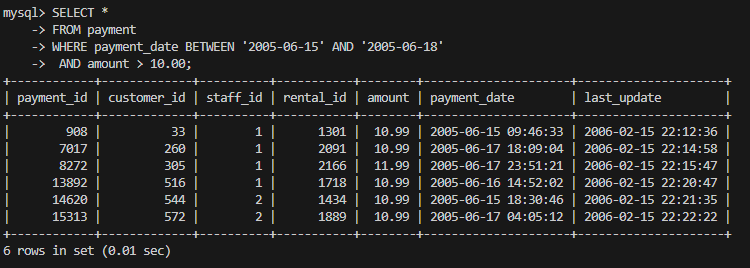
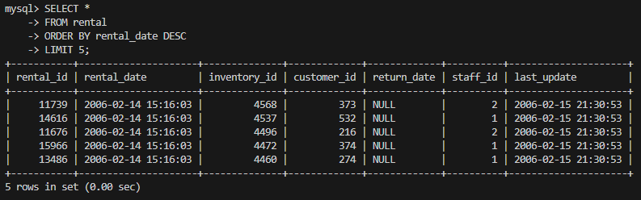
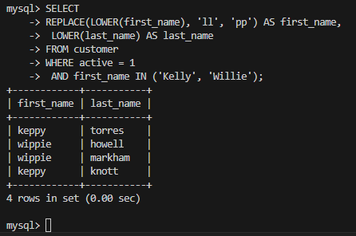
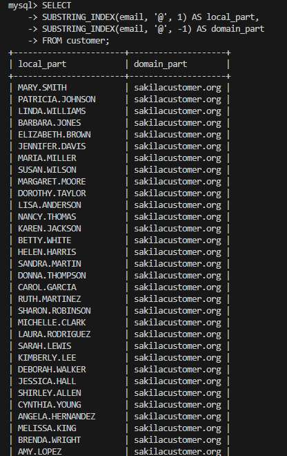
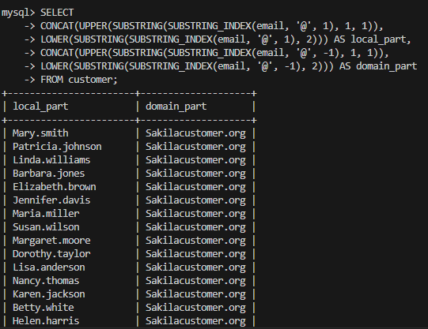

# Домашнее задание к занятию "`SQL. Часть 1`" - `Корбут Евгений`

### Задание 1

1. `Я поднял чистый инстанс MySQL версии 8.0+ с использованием контейнера Docker.`

2.  ` Создал БД.`

3. `Импортировал схеммы и данные.`

4. `Подключился к контейнеру и вывел таблицы для проверки.`

5. `Получил уникальные названия районов из таблицы с адресами, которые начинаются на “K” и заканчиваются на “a” и не содержат пробелов.`

---

### Задание 2

`Получил из таблицы платежей за прокат фильмов информацию по платежам, которые выполнялись в промежуток с 15 июня 2005 года по 18 июня 2005 года включительно и стоимость которых превышает 10.00.`

---

### Задание 3

`Получил последние пять аренд фильмов.`

---
### Задание 4

`Одним запросом получил активных покупателей, имена которых Kelly или Willie. Сформировал вывод в результат таким образом:`
`LOWER(first_name) — перевел имя в нижний регистр.`
`REPLACE(LOWER(first_name), 'll', 'pp') — заменил все 'll' на 'pp'.`
`LOWER(last_name) — перевел фамилию в нижний регистр.`
`active = 1 — только активные клиенты.`

---
### Задание 5*

`Вывел Email каждого покупателя, разделив значение Email на две отдельных колонки: в первой колонке значение, указанное до @, во второй — значение, указанное после @.`
`SUBSTRING_INDEX(email, '@', 1) — берёт всё до первого @.`
`SUBSTRING_INDEX(email, '@', -1) — берёт всё после последнего @.`

---
### Задание 6*

`Доработал запрос из предыдущего задания, скорректировал значения в новых колонках: первая буква заглавная, остальные — строчные.`
`CONCAT(UPPER(...), LOWER(...)) — первая буква заглавная, остальные строчные`

---